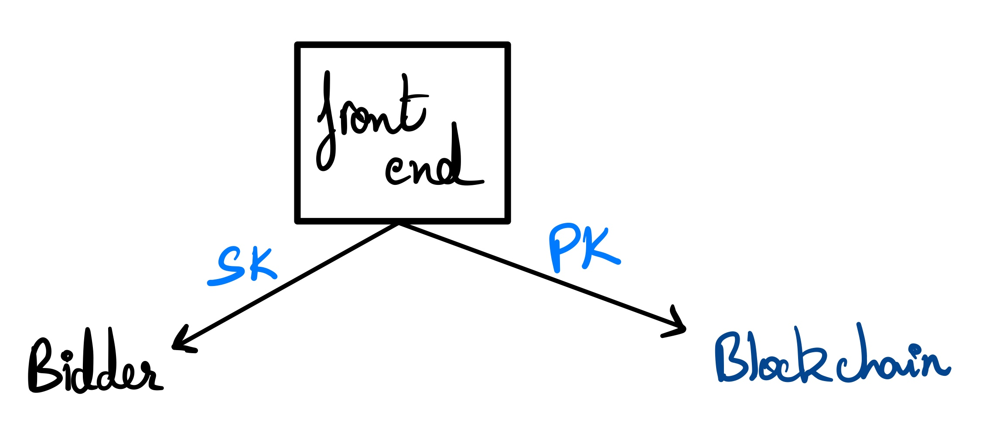

# Assignment 2 report

### Team members

**⇒** **Aakash Jain** →2019101028

**⇒** **Ishaan Shah** →2019111028

**⇒** **Zeeshan Ahmed** → 2019111024

### Problem Statement

To extend the logic of the marketplace created to accommodate auctions of 3 kinds, and to create a frontend that is able to interact with the contracts in the required methods.

## Programming Logic

### Auction Contracts

Since all the contracts share most of the details, there's a `ParentContract` that handles all the common functions.

Three classes have been inherited for each contract

- `FirstPrice`
- `SecondPrice`
- `AveragePrice`

The inherited contracts overload `endTrigger` function that decides the auction winner when the seller decides to end the auction.

## Adding New marketplaces

Due to the limit of the byte size, there is a separate marketplace for each of the auctions. The front end fetches all the auctions and items from the $4$ marketplaces and accordingly the seller item is put into the correct marketplace.

### Auction Format

The auctions run indefinitely and the seller has the control to change the phases.

add - bid - reveal - end

---

## Maintaining Privacy

Smart contracts' key purpose is to make transactions secure and immutable on a public platform. All data is available to every single node, even the private variables can be retrieved using address manipulation.

### Hiding Bid amounts

Since all the auctions are blind auctions, the bids should be not revealed to any party other than the bidder.  The bidder has to input 2 different values, deposit and the bid.

- The deposit is the amount of ethereum transferred to the smart contract
- Bid is the value that the bidder actually wants to bid, this value is hashed and sent.
- For a valid bid: deposit >= bid

During the reveal phase, the bidder has to reveal their bid by passing in the actual value. If the reveal value's hash matches with the original blinded bid then the bid is considered to be valid.

### How to hide the string

Generating public key encryption keys

Since it is infeasible to hide the string on the blockchain, it is better to use symmetric encryption with the buyer off the chain.

Due to the new addition of the frontend, it opened up the possibility of doing things off chain. We added functionality in the frontend to create public keys and hand it over to the bidder.

- When a buyer bids on an item, a public key pair is generated on the front end.
- The user is prompted with the private key → They are supposed to note it down for later
- The public key is appended to the blockchain, from where the seller is able to obtain the key of the winner(according to the logic). When the $\text{end}$ is the state, the seller must input the item string that was sold.
- The front end uses the buyer's public key and encrypts the string and appends it back to the blockchain.
- The buyer now has to pay the required amount and input the private key earlier stored to get the item.

---
